# 1 Reversing Basic Challenge #0

https://dreamhack.io/wargame/challenges/14

이 문제는 사용자에게 문자열 입력을 받아 정해진 방법으로 입력값을 검증하여 correct 또는 wrong을 출력하는 프로그램이 주어집니다.

해당 바이너리를 분석하여 correct를 출력하는 입력값을 찾으세요!

획득한 입력값은 DH{} 포맷에 넣어서 인증해주세요.

예시) 입력 값이 Apple_Banana일 경우 flag는 DH{Apple_Banana}

## Solution

해당 exe file을 다운로드 받은 다음에 Text editor로 문서를 연다.


상기 이미지 내 값을 ASCII로 읽으면

43 6F 6D 70 61 72 33 5F 74 68 65 5F 73 74 72 31 6E 67
Compar3_the_str1ng

라는 값을 읽을 수 있으며 해당 값이 flag이다.

</br>
</br>

# 2 Reversing Basic Challenge #1


https://dreamhack.io/wargame/challenges/15

이 문제는 사용자에게 문자열 입력을 받아 정해진 방법으로 입력값을 검증하여 correct 또는 wrong을 출력하는 프로그램이 주어집니다.

해당 바이너리를 분석하여 correct를 출력하는 입력값을 알아내세요.

획득한 입력값은 DH{} 포맷에 넣어서 인증해주세요.

예시) 입력 값이 Apple_Banana일 경우 flag는 DH{Apple_Banana}

## Solution

이 문제도 text editor로 찾을 수 도 있지만, 이번에는 x64 dbg로 정답을 찾아보도록 하자.


x64 dbg에 exe file을 넣고 ASICC 검색 기능을 사용하면, 이렇게 해당 프로그램에 단서를 찾을 수 있다.

INPUT 쪽을 클릭해서 해당 주소로 이동해보자.


해당 코드를 읽어보면, Input으로 256 byte string 입력값을 받고, 위의 이미지 내에 Call chall1.7FF7B59A10000 주소 내에 함수에서 해당 Input을 비교하는 함수가 있다는 것을 알 수 있다. 


해당 주소를 점프하면 비교 할 String 값이 보인다. {Compa~로 시작하는 문장 }

</br>
</br>

# 3 Reversing Basic Challenge #3


https://dreamhack.io/wargame/challenges/17

이 문제는 사용자에게 문자열 입력을 받아 정해진 방법으로 입력값을 검증하여 correct 또는 wrong을 출력하는 프로그램이 주어집니다.

해당 바이너리를 분석하여 correct를 출력하는 입력값을 찾으세요!

획득한 입력값은 DH{} 포맷에 넣어서 인증해주세요.

예시) 입력 값이 Apple_Banana일 경우 flag는 DH{Apple_Banana}

## Solution

이번 문제는 단순하게 disassembler로 쉽게 문제가 해결되지는 않았다.

우선 접근 방법은 2번 문제와 유사하게 진행되는데 실제 String 비교 함수에 들어갔을 때가 문제였다. 

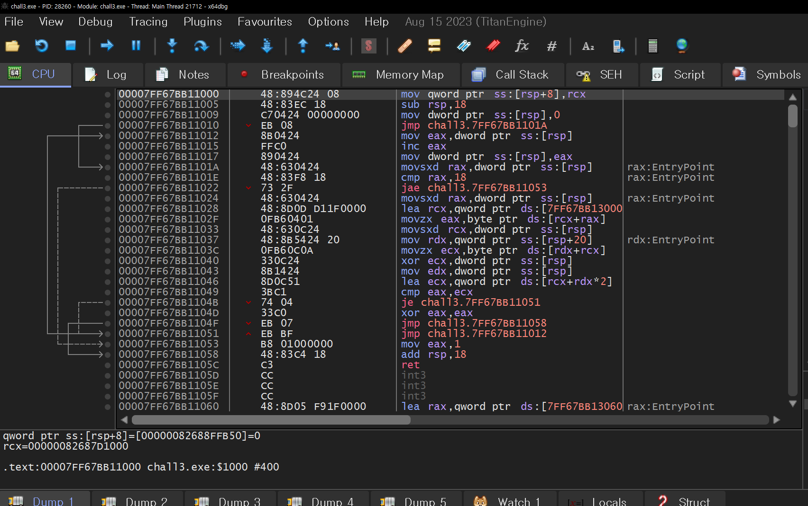

비교 함수 내부를 어셈블리코드 자체로 해석할 수도 있지만, 이런 경우에는 decompiler를 사용하게 효과적이다. 해당 함수영역을 잡고 decompiler를 적용하면 아래와 같이 코드를 뽑아낼 수 있다. 

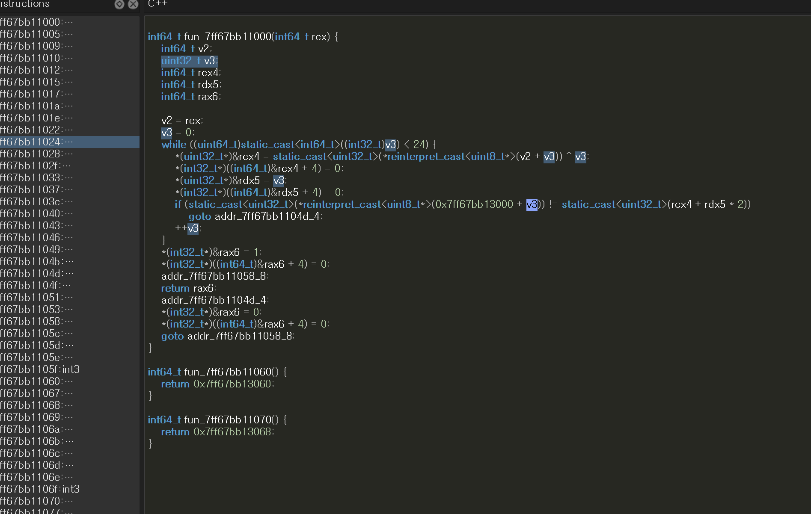

해당 함수의 While문을 살펴보면, v3가 index이며, 0x7FF67BB13000에 있는 uin8짜리 24개 배열에 담긴 특정 값을 가져와서 비교 연산을 하고 있음을 알 수 있다. 

비교 연산의 수식을 살펴보면, rcx4 + rdx5 * 2이다.

좀 더 풀어서 써보면, (rcx + index) ^ index + index * 2 이다.

조건문의 양변을 가지고 정리를 해보면, 

0x7FF67BB13000[index] = (rcx + index) ^ index + index * 2

0x7FF67BB13000[index] - index * 2 = (rcx + index) ^ index 

(0x7FF67BB13000[index] - index * 2) ^ index = rcx + index

여기서 rcx는 input string의 주소이다.

자 이제 0x7FF67BB13000 내부의 데이터가 뭔지 알면 역연산을 이용해 코드를 간단히 작성해서 답을 찾을 수 있다. 


0x7FF67BB13000의 값을 찾아보면 아래와 같다. 

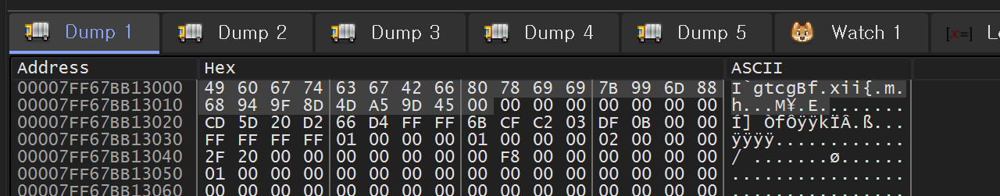

</br>
총 24개의 데이터를 가지고 역연산 코드를 작성해보자.
</br>
</br>
</br>

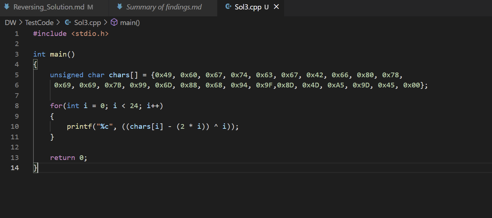

코드를 작성하면 위와 같이 이제 어떤 답이 들어왔을 때 Correct가 되는지 확인할 수 있다. 

이제 빌드해서 코드를 돌려보자.

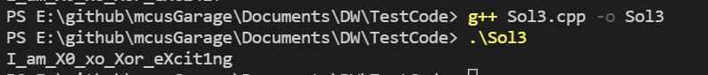

자 이렇게 답을 구할 수 있었다. 

</br>
</br>
</br>

# Reversing Basic Challenge #2

https://dreamhack.io/wargame/challenges/16

이 문제는 사용자에게 문자열 입력을 받아 정해진 방법으로 입력값을 검증하여 correct 또는 wrong을 출력하는 프로그램이 주어집니다.

해당 바이너리를 분석하여 correct를 출력하는 입력값을 찾으세요!

획득한 입력값은 DH{} 포맷에 넣어서 인증해주세요.

예시) 입력 값이 Apple_Banana일 경우 flag는 DH{Apple_Banana}

## Solution

앞 서 푼 문제와 거의 유사하다

우선 ASCII code로 Input 입력 받는 곳을 찾아가 보자.

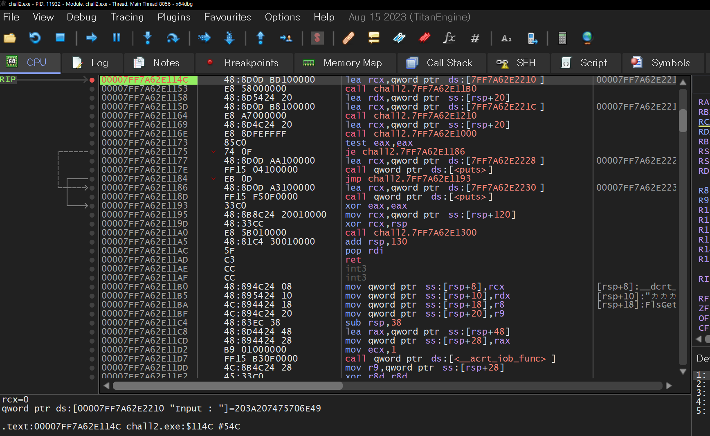

어셈블리 코드를 살펴보면 이전 문제와 마찬가지로 256byte string input을 받아서 특정 함수로 점프하는 것을 확인할 수 있다. 

해당 함수의 주소는 0x7FF7A62E1000이다.

해당 함수 안으로 들어가서 보면, 


위와 같은 어셈블리 코드를 볼 수 있다. 

어셈블리 코드를 살펴보면, rax가 처음에는 0의 값을 가지고 있다가 1씩 증가하는 루프를 돌고 12가 되면 루프가 끝나는 구조이다.

0x12는 17이고, 0부터 시작하면 18번이다.

루프를 도는 동안에 ds : [7FF7A62E3000]에 있는 값을 비교함을 알 수 있다. 

해당 주소를 dump 뜨면 아래와 같다. 

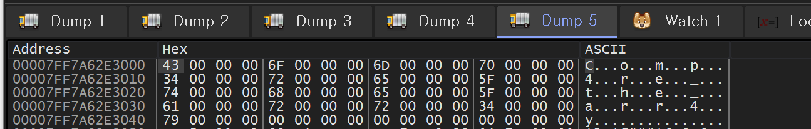

</br>
</br>

# Patch

https://dreamhack.io/wargame/challenges/49

flag를 그리는 루틴을 분석하고 가려진 flag를 보이게 해주세요.

</br>
</br>

## Solution

이번 문제는 exe file을 실행하면 나오는 특정 프로그램에 특정 함수를 멈춰서 답을 찾는 문제이다. 

우선 문제의 exe file을 실행해보자.


해당 파일을 실행하면, 위와 같은 프로그램이 실행되는데 뭔가 글자가 가려져 있는 것을 확인할 수 있다. 

즉, 저 검은색으로 칠해진 부분을 제거하고 그 안에 있는 문자를 찾으면 되는 문제로 보여진다.

자 그러면 이제 이 프로그램을 x64 dbg에 넣고 F7을 눌러가면서 어느시점에 이 검은색이 칠해지는지 찾아보자.


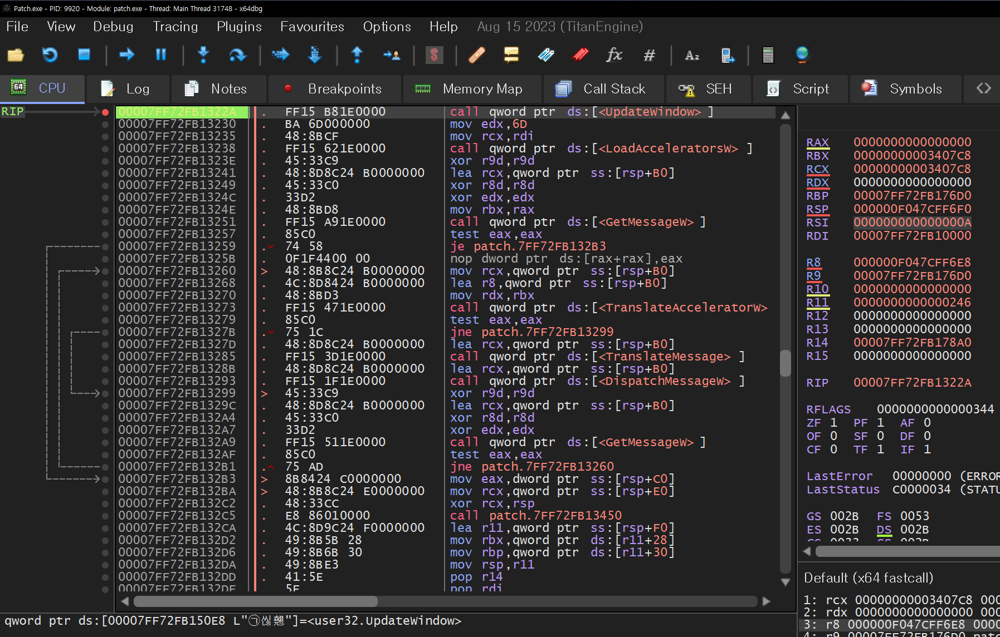

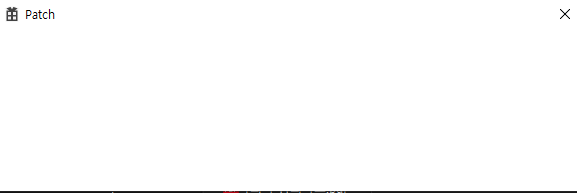

위와 같이 UpdateWindow라는 함수를 지나면서 Patch 프로그램 창이 뜨는 것을 확인할 수 있다. 

그러면 이 이후에 특정 시점에 저 검은색 선이 칠해진다고 볼 수 있으므로 계속 F7을 눌러가면서 위치를 특정해보도록 하자.

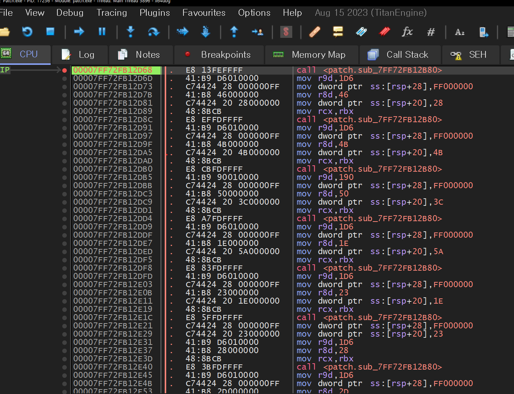

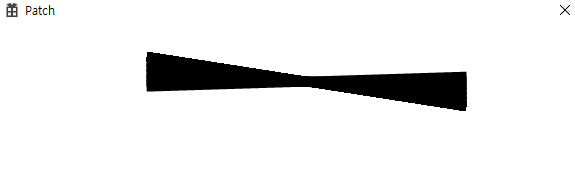

sub_7FF72FB12B80을 지날 때마다 검은 색 선이 생기는 것을 확인할 수 있다. 

우리는 여기서 하나를 유추할 수 있는데 먼저 검은색 선이 칠해지고 나서 글씨가 써지는 것을 알 수 있다. 

그렇다면 이 선이 그어지는 함수를 막아버린다면, 답을 찾을 수 있을 것이다.


위에서 찾은 0x7FF72FB12B80 함수에 왔다. 
자 여기서 어떻게 하면 이 함수를 동작하지 않게 할 수 있을까?

바로 함수 시작 부분의 assembly code를 변경하는 것이다. 

ret로 변경한다면, 함수 진입과 동시에 리턴할 것 이다.


위와 같이 해당 주소의 assembly code를 변경하였다. 

이 상태에서 F9를 눌러 프로그램 Run을 시켜보자.

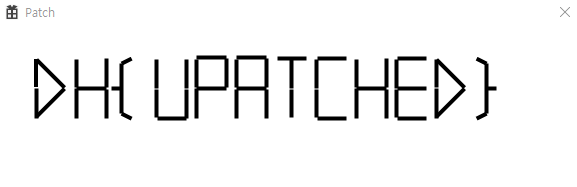

위와 같이 숨겨져 있던 답이 나오게 된다. 

</br>
</br>
</br>

# 6 Reversing Basic Challenge #4

https://dreamhack.io/wargame/challenges/18

이 문제는 사용자에게 문자열 입력을 받아 정해진 방법으로 입력값을 검증하여 correct 또는 wrong을 출력하는 프로그램이 주어집니다.

해당 바이너리를 분석하여 correct를 출력하는 입력값을 알아내세요.

획득한 입력값은 DH{} 포맷에 넣어서 인증해주세요.

예시) 입력 값이 Apple_Banana일 경우 flag는 DH{Apple_Banana}

## Solution

이 문제는 앞에서 계속해서 풀었던 문제와 거의 유사한 문제이다.

이 문제도 결국 x64 dbg를 가지고 input symbol쪽으로 찾아 들어가서 decompiler를 돌려보면 실마리를 찾을 수 있다. 

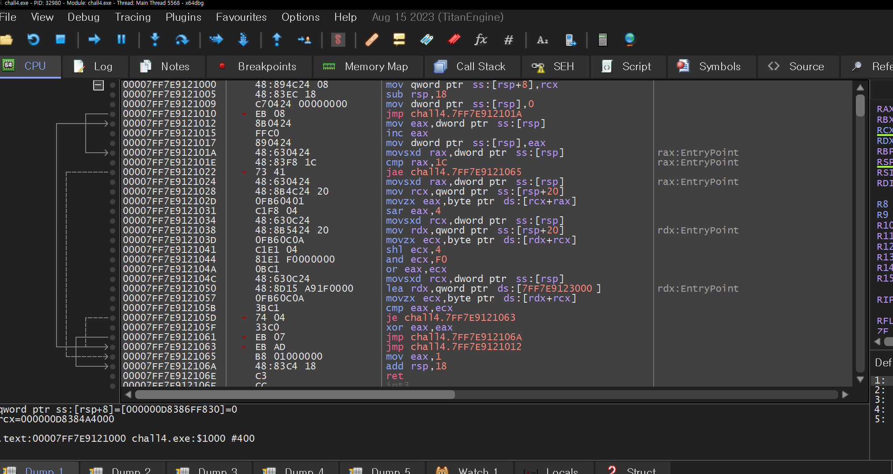

위 영역이 input 쪽 아래에 input과 특정 값을 비교하는 함수의 구현부이다. 

이 부분을 decompiler로 돌려보자.


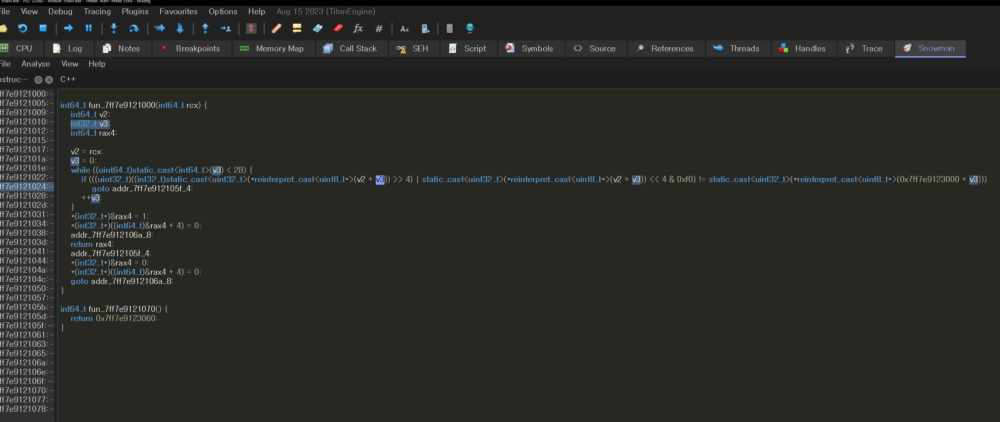

해당 함수를 살펴보면, if 조건문에 있는 내용을 해석해보면 문제를 풀 수 있다는 것을 알 수 있다. 

조건문은  

```c
if (((uint32_t)((int32_t)static_cast<uint32_t>(*reinterpret_cast<uint8_t*>(v2 + v3)) >> 4) | static_cast<uint32_t>(*reinterpret_cast<uint8_t*>(v2 + v3)) << 4 & 0xf0) != static_cast<uint32_t>(*reinterpret_cast<uint8_t*>(0x7ff7e9123000 + v3))) 
```

이 조건을 해석해보면, ( 16 * a1[i] )  ||  (a1[i] >> 4 ) != 0x7ff7e9123000[i] 이다.

심플하다. 

이제 이걸 a1[i]에 관해서 치환한 다음에 코드로 역연산을 때리면 된다.

그리고 0x7ff7e9123000에 들어있는 데이터도 참조하자.


이제 이 데이터를 가지고 역연산 코드를 작성해보자.

```c
#include <stdio.h>

int main(){
    int _array[27] = 
    {
        0x24, 0x27, 0x13, 0xC6, 0xC6, 0x13, 0x16, 0xE6, 0x47, 0xF5,
        0x26, 0x96, 0x47, 0xF5, 0x46, 0x27, 0x13, 0x26, 0x26, 0xC6,
        0x56, 0xF5, 0xC3, 0xC3, 0xF5, 0xE3, 0xE3
    };

    for(int i = 0; i < 27; i++)
    {
        printf("%c", (16 * _array[i]) & 0xF0 | (_array[i] >> 4));
    }
    
    return 0;
}
```

해당 코드를 돌리면 아래와 같이 정답을 발견할 수 있다. 


# 7 Reversing Basic Challenge #5

이 문제는 사용자에게 문자열 입력을 받아 정해진 방법으로 입력값을 검증하여 correct 또는 wrong을 출력하는 프로그램이 주어집니다.

해당 바이너리를 분석하여 correct를 출력하는 입력값을 찾으세요!

획득한 입력값은 DH{} 포맷에 넣어서 인증해주세요.

예시) 입력 값이 Apple_Banana일 경우 flag는 DH{Apple_Banana}

https://dreamhack.io/wargame/challenges/19

## Solution

이 문제는 Reversing Basic Challenge 시리즈 문제와 형식이나 방식이 똑같으므로 문제풀이의 앞부분은 건너 뛰고, 핵심인 Input string value 판정 부분을 세밀하게 보도록 하겠다. 

앞 서 다른 문제와 마찬가지로 Input 뒤에 판단하는 함수로 들어가서 해당 함수를 Decompiler로 돌려보면 아래와 같다.

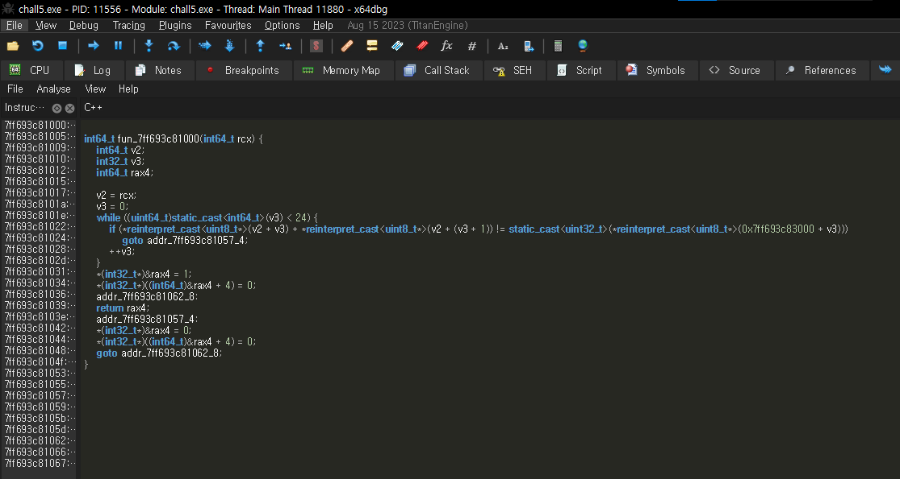

Decompilering된 부분을 자세히 살펴보면, i번지, i+1번지 데이터가 들어와서 특정 주소에 있는 결과와 같은지를 확인하는 코드이다.

자 먼저 그럼 비교되는 값은 무엇인지 메모리 맵을 통해 찾아보자.

해당 값은 0x7ff693c83000에 있을 것 이다.

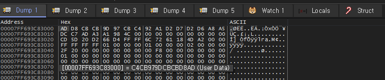

비교 대상이 되는 값은 위와 같다. 

해당 문제를 해결해기 위해 역연산 코드는 아래와 같이 짤 수 있다. 

```c
#include <stdio.h>
int main(){
    int src[0x18] = {0xAD, 0xD8, 0xCB, 0xCB, 0x9D, 0x97,
    0xCB, 0xC4, 0x92, 0xA1, 0xD2, 0xD7, 0xD2, 0xD6, 
    0xA8, 0xA5, 0xDC, 0xC7, 0xAD, 0xA3, 0xA1, 0x98,
    0x4C, 0x00};

    int str[0x18+1]={0,};

    for(int i=0x18-1; i>=0; i--){
        str[i]=src[i]-str[i+1];
    }

    for(int i=0; i<0x18; i++){
        printf("%c", str[i]);
    }
}
```
해당 함수를 실행시키면 아래와 같이 결과를 얻을 수 있게 된다. 

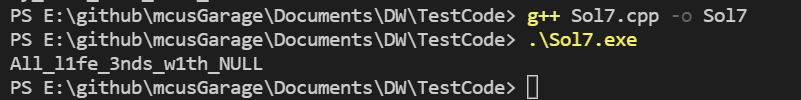
