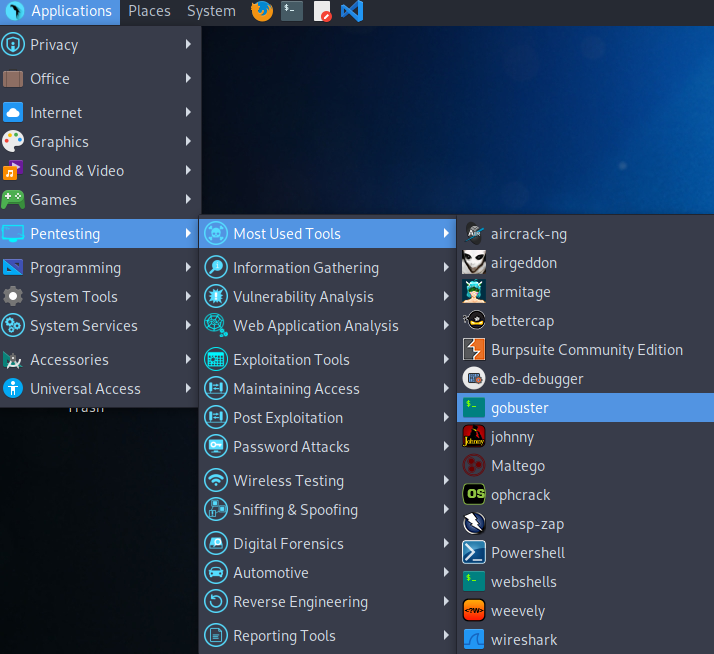

# 해킹용 리눅스 배포판
----------------

1. **Kali Linux**
   - 해킹 및 침투용으로 가장 널리쓰이는 리눅스 배포판(데비안)
   - 기본적인 해킹용 툴들이 배포판 내에 적용되어 있음.
   - 가장 널리 쓰이기 때문에 사용 사례나 질문이 쉬움.
   - 그러나 설정 가능한 범위가 너무 광범위하여 초보자에게 어려울 수 있으며 anonymity 와  crypto 관련 툴이 부족함.
2. **BackBox**
   - 칼리 리눅스의 경쟁자(우분투 기반 배포판)
   - 우분투 기반으로 칼리 리눅스 대비 더 나은 GUI 환경으로 초보자 친화적
   - 더 많은 기본 툴 제공(암호화, 익명성 툴{토르 등}등)
3. **ParrotOS**
   - 칼리 리눅스의 강화판(경량 데비안)
   - 해킹용 툴들이 칼리 리눅스 대비 더 많이 구비되어있음.
   - 기본 프리셋이 어느정도 잡혀있으며 보안 및 익명성 관련 툴 또한 제공
   - 다양한 variation이 존재함
4. **BlackArch**
   - arch 리눅스 기반 배포판
   - 실전 지향적 툴이 많음 (안티 포렌식,멀웨어, 키로거, 백도어, 스니퍼, 퍼저 등..)
   - GUI 지원이 제일 미비하여 유저 접근성이 떨어짐 (CLI로 거의 모든것을 해결)
   - 실전용으로는 적합하나 CTF에 적합하지 않아보임
5. **Samurai Web Testing Framework**
   - 우분투 기반 웹 침투 전용 배포판
   - 가상머신 이미지로 배포
   - 웹 전용으로 CTF에 적합하지 않아 보임.
6. **Pentoo**
   - Gentoo 리눅스 기반 보안 및 침투(Penetration) 테스트 전용 배포판.
   - 역시 CTF에 적합하지는 않아보임.
7. **CAINE**
   - Computer Aided Investigative Environment
   - 디지털 포렌식 프로젝트로써 개발, 시스템 포렌식 및 분석을 위한 배포판.
   - CTF에 부적합
8. **Network Security Toolkit**
   - Fedora 기반 배포판, 오픈소스 네트워크 보안 도구 제공
   - 주로 블루팀(방어팀)에 유용한 툴 제공
   - CTF에 부적합
9.  **Fedora Security Spin**
   - 보안 검사 및 테스트용으로 설계된 Fedora 기반 배포판
   - CTF에 부적합
10. **ArchStrike**
   - Arch 리눅스 기반 침투 테스트 전용 배포판.
   - 모듈식 패키지 그룹으로 분류된 다양한 프로그램을 제공하나 대부분이 침투용 툴
   - CTF에 부적합

----------------
- 결과적으로 입문자의 경우 아래 두개의 배포판이 제일 적합한것으로 판단됨.
  - Kali Linux
    - https://www.kali.org/get-kali/#kali-platforms
    - VM 혹은 ISO로 설치 권장.
  - Parrot Linux
    - https://www.parrotsec.org/download/
    - VM 혹은 ISO로 설치 권장.

- VM의 설치를 제일 권장하는 이유는 Kernel<-> Filesystem 영역까지는 해당 배포판의 기능을 온전히 사용할수 있다는 점.
- 권장 스토리지 용량은 Kali linux는 최소 20GB, Parrot OS는 최소 15GB를 요구함.
- 설치법은 아래의 영상을 참조
  - 칼리 리눅스 : https://www.youtube.com/watch?v=l97dVIKlmVg&pp=ygUgaW5zdGFsbCBrYWxpIGxpbnV4IG9uIHZpcnR1YWxib3g%3D
  - 패럿 OS : https://www.youtube.com/watch?v=9z-_h7aChDI

- 설치가 완료되면 아래와 같은 화면을 확인 할 수 있음
  - 칼리
  
  ##
  - 패럿
  

- 두 배포판 모두 사용자 UI에서 쉽게 툴들에 접근할 수 있으며, 또한 CLI 환경에서의 완벽한 동작을 수행한다. 
- 두 OS 모두 Debian 배포판이므로 sudo apt ~ 로 원하는 패키지를 추가로 설치할 수 있다.